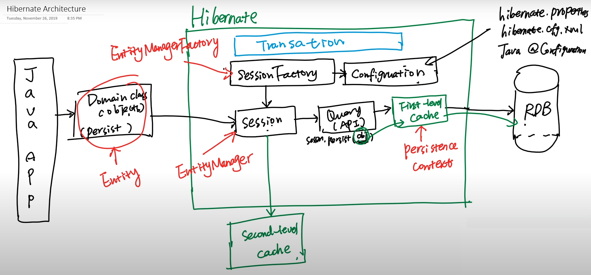

# Hibernate Architecture



-   First-level cache level is alive in one request, it help us don't need to query DB multi-time in one request
-   Second-level cache can share data among multi request, but Hibernate only provide API, we need provide a vendor, ex: Eh-cache
-   In JPA:
    -   Entity = Domain/Object
    -   EntityManagerFactory = SessionFactory
    -   EntityManager = Session
    -   First-level cache = PersistenceContext

# Hibernate Project Setup

**1. Add dependencies**

```xml
<dependency>
    <groupId>org.hibernate</groupId>
    <artifactId>hibernate-core</artifactId>
    <version>5.6.15.Final</version>
</dependency>
<!-- https://mvnrepository.com/artifact/com.mysql/mysql-connector-j -->
<dependency>
    <groupId>com.mysql</groupId>
    <artifactId>mysql-connector-j</artifactId>
    <version>8.0.33</version>
</dependency>
```

**2. Config bootstrap**

Have 2 way to config bootstrap:

-   Native bootstrap (Hibernate native)
-   JPA boostrap

Prefer JPA way, this is example of `persistence.xml`
Note: XML must be placed under `\resources\META-INF`

```xml
<!-- persistence.xml -->
<persistence xmlns="http://xmlns.jcp.org/xml/ns/persistence"
             xmlns:xsi="http://www.w3.org/2001/XMLSchema-instance" version="2.2"
             xsi:schemaLocation="http://xmlns.jcp.org/xml/ns/persistence http://xmlns.jcp.org/xml/ns/persistence/persistence_2_2.xsd">
    <persistence-unit name="org.example">
        <description>
            Persistence unit for Hibernate
        </description>

        <provider>org.hibernate.jpa.HibernatePersistenceProvider</provider>
        <properties>
            <property name="packagesToScan" value="org.example.domain"/>
            <property name="javax.persistence.jdbc.url" value="jdbc:mysql://localhost:3306/hibernatedemo1?useSSL=false"/>
            <property name="javax.persistence.jdbc.driver" value="com.mysql.cj.jdbc.Driver"/>
            <property name="javax.persistence.jdbc.user" value="root"/>
            <property name="javax.persistence.jdbc.password" value="admin"/>
            <property name="javax.persistence.schema-generation.database.action" value="drop-and-create"/>
            <property name="hibernate.dialect" value="org.hibernate.dialect.MySQL5Dialect"/>
            <property name="hibernate.cache.provider_class" value="org.hibernate.cache.internal.NoCachingRegionFactory"/>
            <property name="hibernate.id.new_generator_mappings" value="false"/>
            <property name="hibernate.show_sql" value="true"/>
            <property name="hibernate.format_sql" value="true"/>
        </properties>
    </persistence-unit>
</persistence>
```

**3. Create the domain model**

```java
// Person.java
@Entity
public class Person {
    @Id
    private Long id;
    private String firstName;
    private String lastName;

    public Person(Long id, String firstName, String lastName) {
        this.id = id;
        this.firstName = firstName;
        this.lastName = lastName;
    }

    public Person() {

    }
}
```

**4. Test the config correct**

```java
// Main.java
public class Main {

    public static void main(String[] args) {
        EntityManagerFactory entityManagerFactory = Persistence.createEntityManagerFactory("org.example");
        EntityManager entityManager = entityManagerFactory.createEntityManager();
        EntityTransaction transaction = entityManager.getTransaction();
        transaction.begin();

        Person p = new Person(123L, "Huy", "teo");

        entityManager.persist(p);

        transaction.commit();
        entityManager.close();
    }
}
```

# Annotation: @Entity and @Table

## 1. @Entity

-   Mark a Java class as an entity (domain model)
-   Mapping entity to a database table
-   If the `@Table` annotation is not provided, Hibernate will use Name of entity to mapping with Name of table

## 2. @Table

-   Optional
-   Specify table detail info for an entity, such as table name, schema, and other attributes
-   If the `@Table` is provided, Hibernate will prior to use the info of `@Table` to mapping entity with real database table

## 3. Other difference
