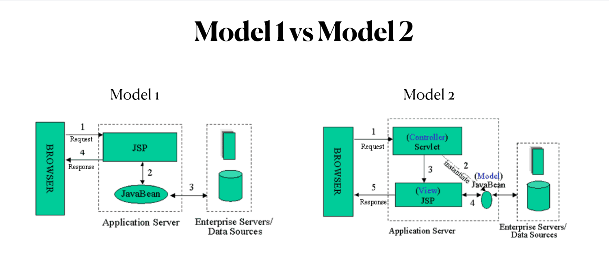

# HTTP

HTTP request and HTTP response

## 1. HTTP request

-   Method: GET, POST, PUT, DELETE,...
-   Header:
    GET /web/index.html?query=value http/1.1
    Accept: text/html, text/plain, img/png,...
    Host: www.google.com
-   Body: not every requests have body

## 2. HTTP response

-   Header:
    http/1.1 200 OK
    content-type: text/html
    content-length: 120 bytes
    ...
-   Line break (very important): separate header and body of response
-   Body: content response

---

# Web Server vs Web Container

-   Static content: html, css, js, image, pdf...
-   Dynamic content: servlet + jsp
-   **Web server** only serve static content: Apache, IIS,...
-   **Web container** serve dynamic content: Tomcat, GlassFish...

---

# Web container & Servlet architecture

-   HTTP request come from browser to server side.
-   TomCat (Web container) convert HTTP request into HTTPServletRequest and find the correct Servlet handle that reuqest.
-   Servlet give back the HTTPServletResponse and Tomcat convert it to HTTP response then send back to browser
-   Servlet is a regular java class. It's deployed on Tomcat (Web Server)

---

# Servlet and Tomcat Compatibility

I don't find a good title for this blog. Just want to summarize which version of Tomcat support which Servlet.

| Platform             | Servlet API version      | Released      | Specification | Tomcat Version             | Important Changes of Servlet API                                           |
| -------------------- | ------------------------ | ------------- | ------------- | -------------------------- | -------------------------------------------------------------------------- |
| Jakarta EE 9         | Jakarta Servlet 5.0.0 M1 | Jun 12, 2020  | 5.0           | 10.0.x                     | API moved from package javax.servlet to jakarta.servlet                    |
| Jakarta EE 8         | Jakarta Servlet 4.0.3    | Aug 13, 2019  | 4.0           | 10.0.x                     | Renamed from "Java" trademark                                              |
| Java EE 8            | Java Servlet 4.0         | Sep 2017      | JSR 369       | 9.0.x                      | HTTP/2                                                                     |
| Java EE 7            | Java Servlet 3.1         | May 2013      | JSR 340       | 8.0.x(superseded) or 8.5.x | Non-blocking I/O, HTTP protocol upgrade mechanism (WebSocket)              |
| Java EE 6, Java SE 6 | Java Servlet 3.0         | December 2009 | JSR 315       | 7.0.x                      | Pluggability, Ease of development, Async Servlet, Security, File Uploading |
| Java EE 5, Java SE 5 | Java Servlet 2.5         | Sep 2005      | JSR 154       | 6.0.x (archived)           | Requires Java SE 5, supports annotation[?]                                 |

Notes:

1.  I only organized the version since Servlet 2.5. It's rarely you'll use version lower than 2.5.
2.  For Jakarta EE 8, I didn't see the actual changes, even the official specification. I downloaded, but the file is kind of empty. And there's no Tomcat support this version.
    Tomcat 10 directly support for Jakarta EE 9.
3.  TODO: Java Servlet 2.5 supports annotations: I need to test on this, definitely 3.0.1 supports annotations, didn't remember 2.5 version also.

References:

1.  https://en.wikipedia.org/wiki/Jakarta_Servlet
2.  https://tomcat.apache.org/whichversion.html

---

# More about web.xml file

-   web.xml: deployment descriptor (DD)
-   Tomcat use this file to config deployment

## 1. Define a servlet

```xml
<servlet>
    <servlet-name>ServletName</servlet-name>
    <servlet-class>package.ClassName</servlet-class>
</servlet>
```

## 2. Define a servlet but JSP file

```xml
<servlet>
    <servlet-name>ServletName</servlet-name>
    <jsp-file>/jsp-name.jsp</jsp-file> (Slash "/" is important)
</servlet>
```

## 3. Mapping a servlet to URL

```xml
<servlet-mapping>
    <servlet-name>ServletName</servlet-name>
    <url-pattern>/url-mapping</url-pattern>
</servlet-mapping>
```

## 4. List welcome file when launch

Find from top to bottom

```xml
<servlet-mapping>
    <servlet-name>ServletName</servlet-name>
    <url-pattern>/url-mapping</url-pattern>
</servlet-mapping>
```

## 5. Servlet init-param (Servlet config)

```xml
<servlet>
    <servlet-name>ServletName</servlet-name>
    <jsp-file>/jsp-name.jsp</jsp-file>
    <init-param>
        <param-name>test</param-name>
        <param-value>me</param-value>
    </init-param>
</servlet>
```

## 6. Application init-param (Servlet context)

```xml
<context-param>
    <param-name>theName</param-name>
    <param-value>theValue</param-value>
</context-param>
```

---

# @WebServlet

The @WebServlet annotation declares a Servlet, but it must annotate classes which extend jakarta.servlet.http.HttpServlet or javax.servlet.http.HttpServlet.

## Attributes of @WebServlet Annotations

| Attribute Name       | Type           | Required | Description                                                                                                                 | Example                                                                                                                                                                           |
| -------------------- | -------------- | -------- | --------------------------------------------------------------------------------------------------------------------------- | --------------------------------------------------------------------------------------------------------------------------------------------------------------------------------- |
| value or urlPatterns | String[]       | Required | Specify one or more URL patterns of the servlet. Either of attribute can be used, but not both. value must start with "/"   | @WebServlet(urlPatterns = {"/sendFile", "/uploadFile"}) or @WebServlet({"/sendFile", "/uploadFile"}) or @WebServlet(value = {"/sendFile", "/uploadFile"})                         |
| initParams           | WebInitParam[] | Optional | Specify one or more initialization parameters of the servlet. Each parameter is specified by @WebInitParam annotation type. | @WebServlet(urlPatterns = "/imageUpload",initParams ={@WebInitParam(name = "saveDir", value = "D:/FileUpload"),@WebInitParam(name = "allowedTypes", value = "jpg,jpeg,gif,png")}) |
| name                 | String         | Optional | Name of the servlet                                                                                                         | @WebServlet(name="helloworld", value="/hello")                                                                                                                                    |
| displayName          | String         | Optional | Display name of the servlet                                                                                                 | @WebServlet(displayName="helloworld", urlPatterns="/hello")                                                                                                                       |
| description          | String         | Optional | Description of the servlet                                                                                                  | @WebServlet(description="helloworld", urlPatterns="/hello")                                                                                                                       |
| asyncSupported       | boolean        | Optional | Specify whether the servlet supports asynchronous operation mode. Default is false.                                         | @WebServlet(asyncSupported=true, urlPatterns="/hello")                                                                                                                            |
| loadOnStartup        | int            | Optional | Specify load-on-startup order of the servlet. default value is -1.                                                          | @WebServlet(loadOnStartup=1, urlPatterns="/hello")                                                                                                                                |
| smallIcon            | String         | Optional | Specify name of the small icon of the servlet.                                                                              | TODO                                                                                                                                                                              |
| largeIcon            | String         | Optional | Specify name of the large icon of the servlet.                                                                              | TODO                                                                                                                                                                              |

**NOTE:** the attributes displayName, description, smallIcon and largeIcon are primarily used by tools, IDEs or servlet containers, they do not affect operation of the servlet.

## Can @WebServlet and web.xml stay together?

Yes, you can have web.xml and @WebServlet both existing in the same project.
But you CANNOT use both ways to declare a servlet which means you either declare Servlet in web.xml or use @WebServlet annotation.
Otherwise, you'll get Exception while deploying your project to web container.

## The value of @WebServlet urlPatterns attribute?

In a project, you CANNOT specify the same URL patterns for different servlets. you'll get Exception while deploying your project to web container.
While you specify value using @WebServlet, the value must start with "/", otherwise, you know now, exception while deploying project.

**Reference:**
https://www.codejava.net/java-ee/servlet/webservlet-annotation-examples

**Demo:**

```java
@WebServlet("/hello") //This set "/hello" to value attribute
@WebServlet(value = "/hello") // same as above
@WebServlet(urlPatterns = "/hello") // this is ok too
@WebServlet({"/hello", "/sample"}) // multi url to value attribute
@WebServlet(urlPatterns = {"/hello", "/sample", "/world"}) // same as above but use urlPatterns
```

---

# Java/Jakarta Servlet Life cycle

A Servlet Life cycle is talking about the entire process from it's creation to the destruction.
Then who is maintaining life cycle of Servlets? There's no main() method in Servlets, so Web Container (Tomcat) takes care of the entire process.

In the following blog, I'll use Tomcat as web container.

The following are the paths went through by a servlet in web container:

1. After deploy servlet app in Tomcat, .class files will be loaded.
2. Tomcat creates servlet instance by using reflection API. Only one instance per servlet. By default, Tomcat instantiates servlet instance when the first request comes to the servlet. The `<load-on-startup>` attribute in web.xml or `@WebServlet` can be used to change to instantiate servlet during Tomcat startup.
3. The servlet's init() method will be called after instantiation. This method will be called only once in entire life cyle of servlet. And servlet cannot serve any request before init() method being called.

```java
@Override
public void init(ServletConfig config) throws ServletException {
    //Put your Initialization code here
}
```

NOTE:

-   How many times as init() being called? Only once. Zero could be a valid answer though, if no request comes to a servlet, by default, Tomcat won't instantiate it.
-   Override init() method in our servlets? As your need.

4. Till now, Tomcat works as a container which holds all instances with servlet and knows which url maps to which servlet via web.xml or @WebServlet.
   When a request comes to Tomcat, Tomcat extracts requesting path from HTTP request, then delegates the request with a thread to the right servlet by calling servlet's service() method.
   The service() method will call doGet(), doPost() or doXXX() method as appropriate based on HTTP request method(GET, POST, PUT, DELETE, etc.).

```java
protected void service(HttpServletRequest req, HttpServletResponse resp) throws ServletException, IOException {
        String method = req.getMethod();
        long lastModified;
        if (method.equals("GET")) {
            lastModified = this.getLastModified(req);
            if (lastModified == -1L) {
                this.doGet(req, resp);
            } else {
                long ifModifiedSince = req.getDateHeader("If-Modified-Since");
                if (ifModifiedSince < lastModified) {
                    this.maybeSetLastModified(resp, lastModified);
                    this.doGet(req, resp);
                } else {
                    resp.setStatus(304);
                }
            }
        } else if (method.equals("HEAD")) {
            lastModified = this.getLastModified(req);
            this.maybeSetLastModified(resp, lastModified);
            this.doHead(req, resp);
        } else if (method.equals("POST")) {
            this.doPost(req, resp);
        } else if (method.equals("PUT")) {
            this.doPut(req, resp);
        } else if (method.equals("DELETE")) {
            this.doDelete(req, resp);
        } else if (method.equals("OPTIONS")) {
            this.doOptions(req, resp);
        } else if (method.equals("TRACE")) {
            this.doTrace(req, resp);
        } else {
            String errMsg = lStrings.getString("http.method_not_implemented");
            Object[] errArgs = new Object[]{method};
            errMsg = MessageFormat.format(errMsg, errArgs);
            resp.sendError(501, errMsg);
        }

    }
```

NOTE:

-   How many times are service() being called? As many times as many requests come.
-   Override service() in our servlets? NO. The service() is fully implemented, and not recommended overriding unless you have a strong reason.

5. doGet(), doPost, doXXX() methods are the ones we override to implement business logic.

```java
public class HelloWorldServlet extends HttpServlet {
    @Override
    protected void doGet(HttpServletRequest req, HttpServletResponse resp) throws ServletException, IOException {
        resp.setContentType("text/plain");
        PrintWriter out = resp.getWriter();
        out.println("Current Time: " + LocalDateTime.now());
    }

    @Override
    protected void doPost(HttpServletRequest req, HttpServletResponse resp) throws ServletException, IOException {
        // POST Request Logic code here
    }
}
```

NOTE:

-   How many times are doXXX()() being called? As many times as many requests come.
-   Override doXXX()() in our servlets? Absolutely 100%. Here are the place you implement business logic.

6. The destory() method is called only once at the end of the life cycle of a servlet.
   This method gives you a chance to close database connections, halt background threads, and perform other cleanup activities.
   After the destory() method is called, the servlet object is marked for garbage collection.

```java
@Override
public void destroy() {
    //Your cleanup activities here
}
```

NOTE:

-   How many times as init() being called? Only once. Zero could be a valid answer though, if no request comes to a servlet, by default, Tomcat won't instantiate it.
-   Override destory() method in our servlets? As your need.

Here is a diagram of Servlet Lifecycle


---

# HTTP Method: Safe Method vs Idempotent

-   An HTTP method is considered "safe" if it does not have the potential to cause any side-effects on the server, such as modifying a resource.

    -   Examples of safe methods include the GET and HEAD methods.

-   An HTTP method is considered "idempotent" if multiple identical requests will have the same effect as a single request. In other words, it doesn't matter how many times the same request is made, the outcome will be the same.
    -   Examples of idempotent methods include the GET, PUT, and DELETE methods.

**For example:** GET request is both safe and idempotent. It's safe because it doesn't make any changes to the server and idempotent because making the same GET request multiple times will always return the same response.

The most common HTTP methods are:

1. GET: retrieves a representation of a resource. This is the most commonly used method and is considered safe and idempotent.

2. POST: submits a representation of a resource for processing by the server. It is not considered safe or idempotent, as it can cause side-effects on the server, such as creating a new resource.

3. PUT: creates or updates a resource. This method is idempotent, meaning that multiple identical requests will have the same effect as a single request.

4. DELETE: deletes a resource. This method is idempotent, meaning that multiple identical requests will have the same effect as a single request.

5. HEAD: returns the headers of a GET request without the response body. It is safe method.

6. OPTIONS: describes the communication options for the target resource. It is safe method.

7. PATCH: applies partial modifications to a resource. It is not considered safe or idempotent, as it can cause side-effects on the server.

These are the most commonly used HTTP methods, but there are others as well, such as CONNECT, TRACE, and so on.

---

# ServletConfig VS ServletContext

## 1. ServletConfig

-   One ServletConfig Object per Servlet
-   Parameters are configured in DD or @WebServlet
-   Parameter values are String type
-   Can be used to pass deploy-time information to Servlet

### 1.1. XML configuration style

```xml
  <?xml version="1.0" encoding="UTF-8"?>
  <web-app version="4.0" xmlns="http://xmlns.jcp.org/xml/ns/javaee"
           xmlns:xsi="http://www.w3.org/2001/XMLSchema-instance"
           xsi:schemaLocation="http://xmlns.jcp.org/xml/ns/javaee
     http://xmlns.jcp.org/xml/ns/javaee/web-app_4_0.xsd">

    <servlet>
      <servlet-name>initParams</servlet-name>
      <servlet-class>miss.xing.InitParamtersServlet</servlet-class>
      <init-param>
        <param-name>title</param-name>
        <param-value>ServletConfigDemo</param-value>
      </init-param>
      <init-param>
        <param-name>configstyle</param-name>
        <param-value>DD</param-value>
      </init-param>
    </servlet>

    <servlet-mapping>
      <servlet-name>initParams</servlet-name>
      <url-pattern>/</url-pattern>
    </servlet-mapping>

  </web-app>
```

```java
public class InitParamtersServlet extends HttpServlet {

    @Override
    public void init(ServletConfig config) throws ServletException {
        super.init(config);
        Enumeration<String> names = config.getInitParameterNames();
        String name = null;
        while (names.hasMoreElements()) {
            name = names.nextElement();
            System.out.println(name + ": " + config.getInitParameter(name));
        }

    }

    @Override
    protected void doGet(HttpServletRequest req, HttpServletResponse resp) throws ServletException, IOException {
        resp.setContentType("text/html");
        PrintWriter out = resp.getWriter();
        out.println("<html><body>");
        out.println("Servlet Init Paramters <br/>");
        out.println("title: " + getInitParameter("title"));
        out.println("<br/>");
        out.println("configstyle: " + getInitParameter("configstyle"));
    }
}
```

NOTE:

-   When override init(), you must call "super.init(config)" to set ServletConfig value.
    Otherwise, in doGet and other doXXX() methods, the ServletConfig will hold null value which means all methods under ServletConfig are NOT working.
    You won't run this issue if you don't override init().

### 1.2 Annotation configuration style

```java
@WebServlet(urlPatterns = "/initParamsAnnotation", initParams = {
        @WebInitParam(name = "title", value = "ServletConfig Init Params Annocation Demo"),
        @WebInitParam(name = "configstyle", value = "annotaion")
})
public class InitParamsAnnotationStyleServlet extends HttpServlet {

    @Override
    protected void doGet(HttpServletRequest req, HttpServletResponse resp) throws ServletException, IOException {
        resp.setContentType("text/html");
        PrintWriter out = resp.getWriter();
        out.println("<html><body>");
        out.println("Servlet Init Paramters Annocation Style<br/>");
        out.println("title: " + getInitParameter("title"));
        out.println("<br/>");
        out.println("configstyle: " + getInitParameter("configstyle"));
    }
}
```

## 2. ServletContext

-   One ServletContext per web appplication. This is really not a good name, because this object is for entire application, not related to particular servlet.
-   Can be used to set application-wide deploy-time information.
-   Available at application level in every servlet, filter,etc.
-   The only way to config is XML, cannot use annotation. Think about it, annotation must be applied on a specific servlet. But ServletContext is used for entire application, not only 1 servlet.

```xml
<?xml version="1.0" encoding="UTF-8"?>
<web-app version="4.0" xmlns="http://xmlns.jcp.org/xml/ns/javaee"
         xmlns:xsi="http://www.w3.org/2001/XMLSchema-instance"
         xsi:schemaLocation="http://xmlns.jcp.org/xml/ns/javaee
   http://xmlns.jcp.org/xml/ns/javaee/web-app_4_0.xsd">

  <context-param>
    <param-name>author</param-name>
    <param-value>Tina</param-value>
  </context-param>
  <context-param>
    <param-name>country</param-name>
    <param-value>China</param-value>
  </context-param>

</web-app>
```

```java
public class InitParamsServlet extends HttpServlet {

    @Override
    protected void doGet(HttpServletRequest req, HttpServletResponse resp) throws ServletException, IOException {
        resp.setContentType("text/html");
        PrintWriter out = resp.getWriter();
        out.println("<html><body>");
        out.println("ServletContext Paramters Only XML Style<br/>");
        out.println("author: " + getServletContext().getInitParameter("author"));
        out.println("<br/>");
        out.println("country: " + getServletContext().getInitParameter("country"));
    }
}
```

---

# Forward vs Redirect

A forward is when a web server internally redirects a client's request to a different resource on the same server. This happens without the client's browser being aware of the redirect, and the client's original URL remains unchanged. A forward is typically used when a resource has been moved or renamed on the same server, and the web server needs to direct the client's request to the new location without the client knowing.

A redirect, on the other hand, is when a web server sends a response to the client with a new location for the requested resource. The client's browser is aware of the redirect, and the client's original URL is replaced with the new location. There are different types of redirects, such as 301 (permanent) and 302 (temporary) redirects. A redirect is typically used when a resource has been moved to a different server or domain, or when a client is requesting an outdated or deprecated resource.

For example, when you type a URL in the browser, the browser sends a request to the web server for the resource at that URL. If the resource has been moved to a different location, the web server can either forward the request to the new location, so the client's browser remains unaware of the redirect, or the web server can redirect the client's browser to the new location, so the client's browser is aware of the redirect and the URL in the browser changes.

Here is an example of how a forward and redirect might be implemented in a servlet:

```java
//Forwarding the request to another servlet
RequestDispatcher rd = request.getRequestDispatcher("/anotherServlet");
rd.forward(request, response);

//Redirecting the browser to a different URL
response.sendRedirect("http://www.example.com/newlocation");
```

---

# Cookies vs Sessions

Cookies and sessions are both used to store information on the client side in order to maintain state between requests. However, they are used in different ways and have some key differences:

## 1. Cookies:

-   Cookies are small text files that are stored on the client's computer by the browser.
-   They are sent back to the server with each request, allowing the server to access the information stored in the cookie.
-   Cookies have a defined expiration time, which means that they will be deleted from the client's computer after a certain period of time.
-   Cookies can be used to store small amounts of information, such as user preferences or login information.

## 2. Sessions:

-   Sessions are created on the server and are typically stored in memory.
-   The server assigns a unique session ID to the client, which is sent to the client in the form of a cookie.
-   The client sends this session ID back to the server with each request, allowing the server to access the stored session information.
-   Sessions do not have an expiration time, they will be deleted when the user closes the browser or when the session has been inactive for a certain period of time.
-   Sessions can be used to store larger amounts of information, such as shopping cart information, and also it can be used for authentication and authorization purposes.

In summary, cookies are used to store small amounts of information on the client side, while sessions are used to store larger amounts of information on the server side, and they use a session ID to keep track of the client's state.

**Demo:**

```java
//Creating a cookie
Cookie cookie = new Cookie("username", "JohnDoe");
cookie.setMaxAge(60*60*24);  //expire in 1 day
response.addCookie(cookie);

//Retrieving a cookie
Cookie[] cookies = request.getCookies();
if (cookies != null) {
    for (Cookie c : cookies) {
        if (c.getName().equals("username")) {
            String username = c.getValue();
        }
    }
}

//Creating a session
HttpSession session = request.getSession();
session.setAttribute("shoppingcart", cart);

//Retrieving a session attribute
HttpSession session = request.getSession();
ShoppingCart cart = (ShoppingCart) session.getAttribute("shoppingcart");

//Delete - Invalidate session
session.invalidate();
```

---

# JSP

-   JSP -> convert: java -> compile: class
-   JSP have 2 content
    -   Static content: html, css, js: will convert to java like this:
    ```java
    // inside the method _jspService()
    out.write("static content here")
    ```
    -   Dynamic content: JSP element

---

# JSP elements

## 1. Declaration

```jsp
<%! insert instance variable %> <%! insert method %>
```

## 2. Scriplet

-   This code will be insert inside the method \_jspService()

```jsp
<% insert java sentence here %>
```

## 3. Expression

-   This code will be convert inside the method \_jspService()

```jsp
<%= insert expression here %>
```

```java
// inside the method _jspService()
out.print(content)
```

## 4. Directive

```jsp
<%@ page import="java class here" %>
<%@ include file="relative path to file" %>
<%@ taglib %>
```

## 5. Comment

-   Will be ignore during convert phase

```jsp
<%-- JSP comment --%>
<!-- HTML comment --%>
```

## 6. Expression lanague (EL)

```jsp
${expression here}
```

## 7. JSP Action

JSP actions are processed by the JSP container and are executed before the JSP page is rendered. Some of the most commonly used JSP actions are:

-   `<jsp:include>`: includes the content of another resource (such as a JSP page, HTML file, or text file) at the current location in the JSP page.

-   `<jsp:forward>`: forwards the request and response to another resource (such as a JSP page or servlet). This is used to redirect the user to another page, and it terminates the current request.

-   `<jsp:useBean>`: creates or finds a JavaBean object, and makes it available for use in the JSP page.

-   `<jsp:setProperty>`: sets a property of a JavaBean object.

-   `<jsp:getProperty>`: retrieves the value of a property of a JavaBean object and outputs it to the response.

---

# JSP implicit object

-   Is a pre-define object in JSP:
    -   HttpServletRequest `request`
    -   HttpServletResponse `response`
    -   PageContext `pageContext`
    -   HttpSession `session`
    -   ServletContext `application`
    -   ServletConfig `config`
    -   JspWriter `out`

---

# JSP Implicit Object - pageContext

In JSP, pageContext is an implicit object of type PageContext class.The pageContext object can be used to set,get or remove attribute from one of the following scopes:

-   page [PageContext.PAGE_SCOPE] - This is default scope
-   request [PageContext.REQUEST_SCOPE]
-   session [PageContext.SESSION_SCOPE]
-   application [PageContext.APPLICATION_SCOPE]

## Example

Use pageContext to set Attribute

```jsp
<%
    pageContext.setAttribute("weather", "Rainy"); //page scope
    pageContext.setAttribute("user", "Tina", PageContext.SESSION_SCOPE); //Session Scope
%>
```

Use pageContext to get Attribute

```jsp
<%
    String name = (String) pageContext.getAttribute("user", PageContext.SESSION_SCOPE);
    out.print("User: ");
    out.print(name);

    System.out.println(pageContext.getAttribute("weather")); //Page Scope
    System.out.println(pageContext.getAttribute("weather", PageContext.REQUEST_SCOPE));
    System.out.println(pageContext.getAttribute("favorite_kpop_group", PageContext.SESSION_SCOPE));
    System.out.println(pageContext.getAttribute("appName", PageContext.APPLICATION_SCOPE));
%>
```

---

### JSP life cycle

-   A JSP life cycle is defined as the process from its creation till the destruction. This is similar to a servlet life cycle with an additional step which is required to compile a JSP into servlet.
-   The following are the paths followed by a JSP:
    1. Translation
    2. Compilation
    3. Initialization
    4. Execution
    5. Cleanup

Here is a diagram of JSP Lifecycle


---

### Expression Language - Expression

1. `${something}`

-   Only work for `Attribute`, no work for `variable`
-   Find Attribute follow Order: PageScope -> Request Scope -> Session scope -> application scope -> ingnore if all not found

2. `${first.second}`

-   `Dot operation` have 2 first: `implicit object` and `Attribute`
-   If first is `Attribute`, second is a `object` then it will call `toString()` method if it bean class have

3. `${first[second]}`

-   `Bracket []`More powerful than `Dot operation`
-   It can be used for accessing `Array` or `List` by using index: `array[0]`, `array["1"]`
-   Can used for accessing `First` have a dot in name: `${pageScope[foo.bar]}`

4. Arithmetic, logical, relational operator.

-   calculate math
-   do logic `if`

5. Have some reverse word
6. null friendly

**Slide: /slide/JSP Expression Language.pdf**

---

# JSP Model 1 vs model 2



---

# PRG Pattern

Slide: /slide/PRG Pattern.pdf

---

# Public JSP and Private JSP

-   `webapp` folder is the root folder. When we use
-   `Public JSP` is JSP file inside `webapp` folder and childrent folder except `WEB-INF` folder
-   `Private JSP` is JSP file inside `WEB-INF` folder
-   The only way to access `Private JSP` is use `Forward`

---

# JSP action

Slide: /slide/JSP Actions.pdf

---

# JSTL

Slide: /slide/JSTL.pdf

---

# Jakarta/Java Filter

Slide: /slide/Filter.pdf
